# 오름(ORM)
## 😊삼성청년SW아카데미 11기 공통프로젝트 1등 (모바일, 우수상)😊

# ORM
> **삼성 청년 SW 아카데미 팀 프로젝트**   **개발기간: 2024.07.08 ~ 2024.08.16**

## 개발팀 소개
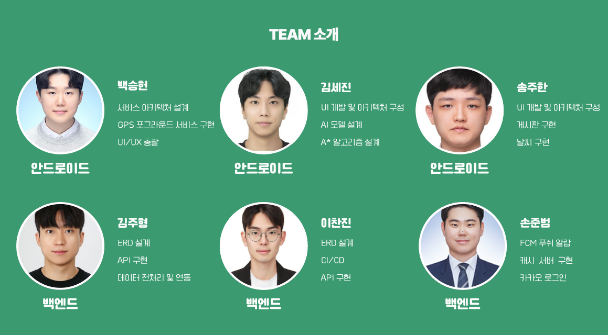

## 프로젝트 소개

"등산과 친해지고 싶은 사람들을 위한 통합 플랫폼”
”자신만의 등산 일지를 기록하고 공유하며, 함께할 친구를 찾아보세요!”

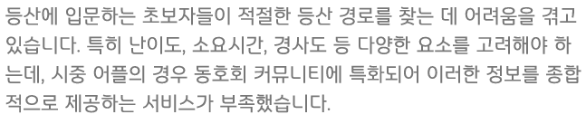
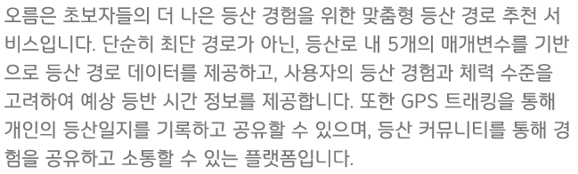

## 주요 역할
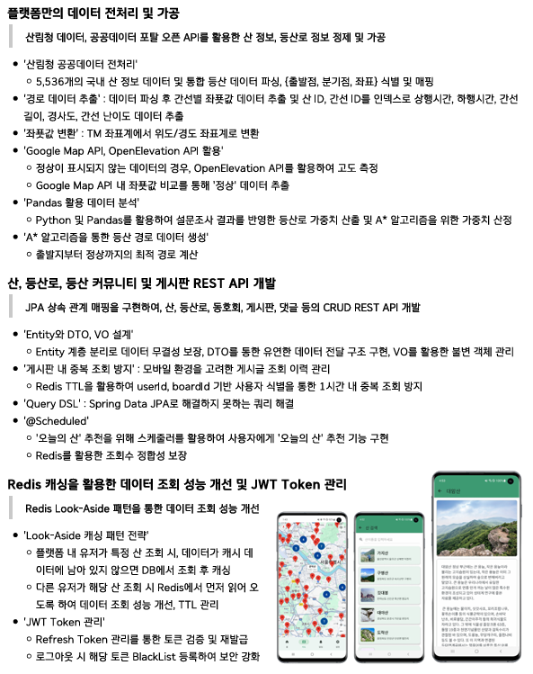

## 프로젝트 성과

- **등산로 추천 서비스 구현**: 사용자 맞춤형 등산로 추천을 통해 사용자 만족도 향상
- **보안성 강화**: OAuth 및 JWT 토큰을 활용한 인증 시스템 구현
- **API 개발 및 문서화**: 다양한 클라이언트 애플리케이션에서 접근 가능한 RESTful API 설계 및 구현

## 시작 가이드
### 포팅 매뉴얼
For building and running the application you need:
https://www.notion.so/yuihirasawa/6bd74947c58e49268ed8740cc8b2a5ef?pvs=4
[포팅매뉴얼.pdf](./exec/포팅매뉴얼.pdf)

## Stacks 🐈
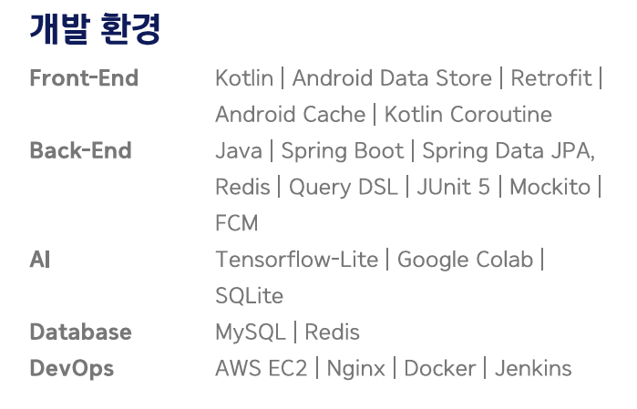

---
## 주요 기능 📦
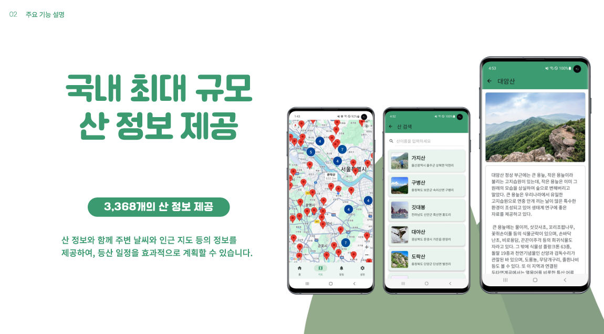
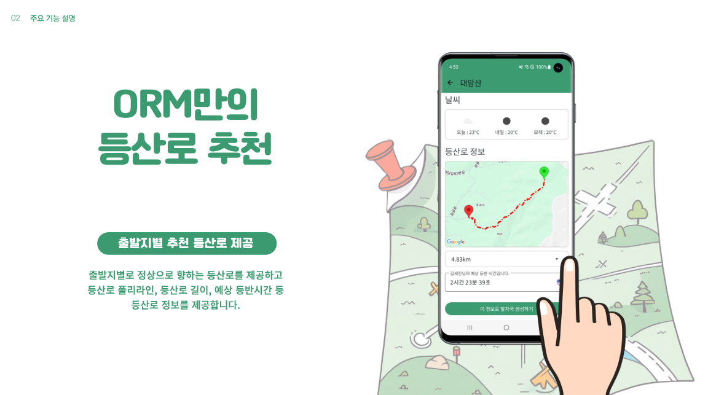

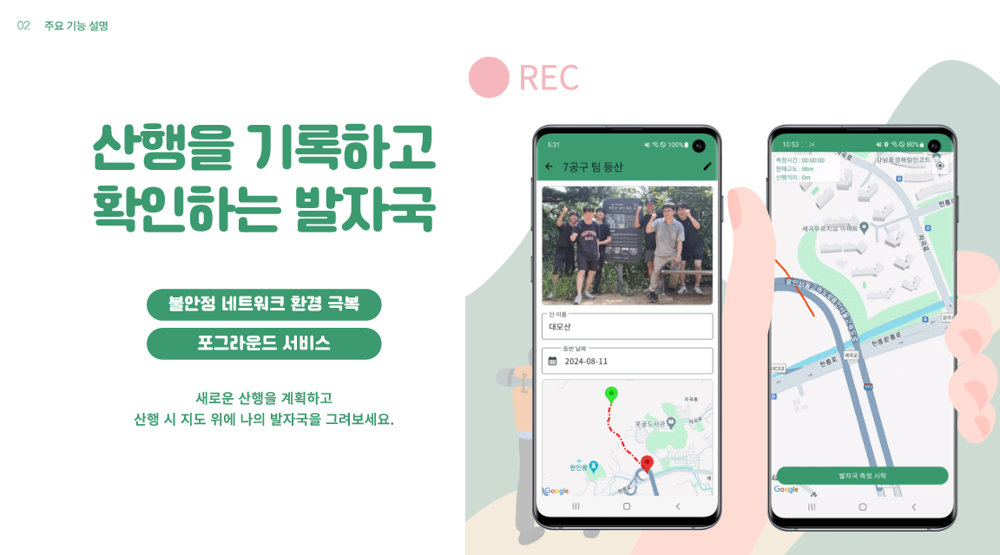
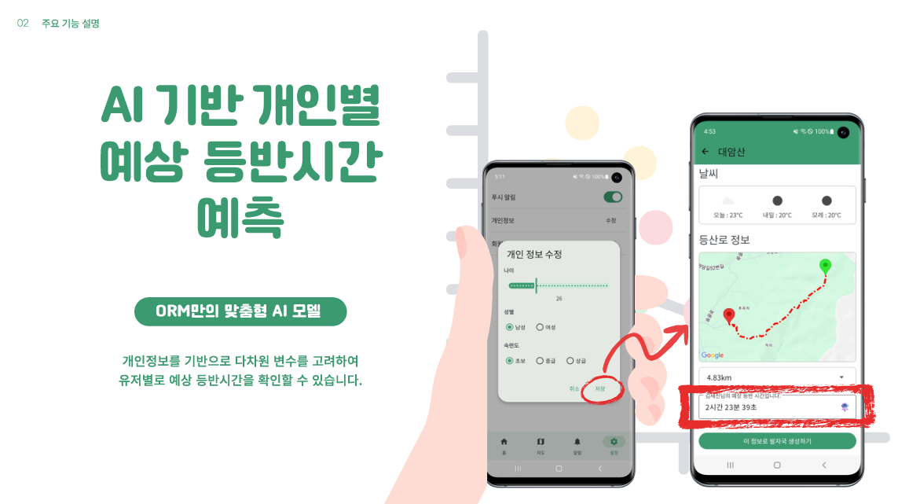
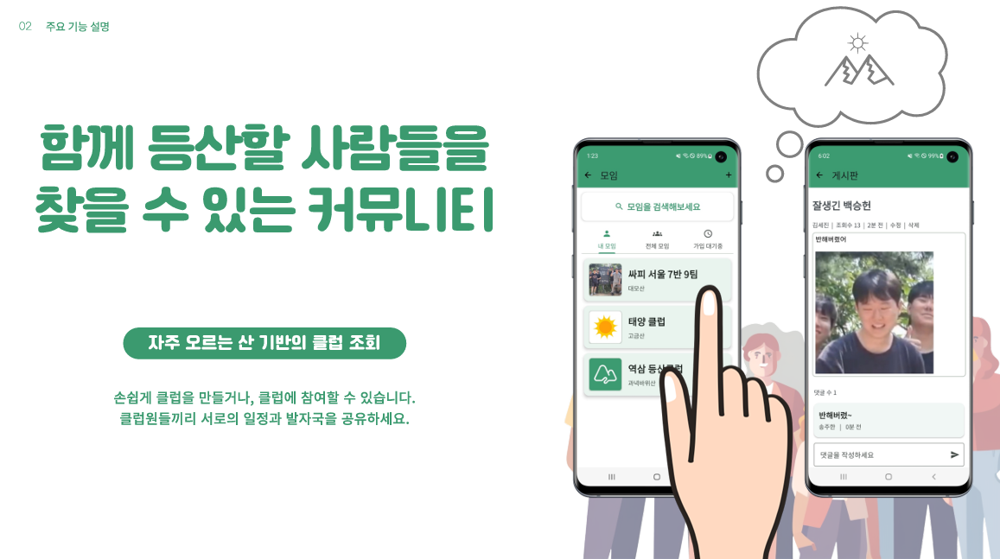

---
## 아키텍쳐
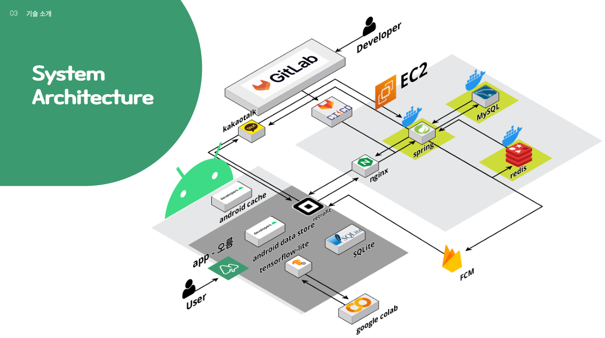

